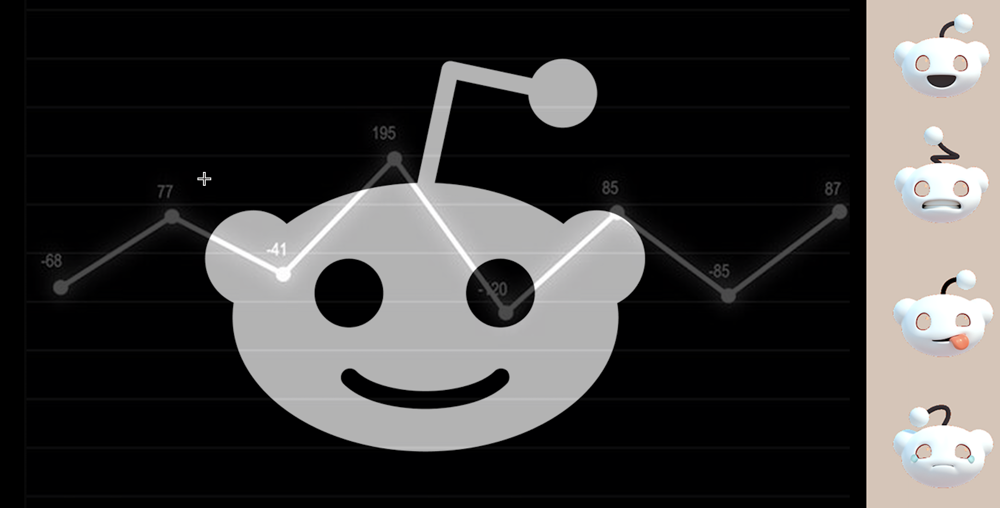

#

<a href="https://reddishtrends.com">

&nbsp&nbsp&nbsp
</a>

##

<a href="https://github.com/HaiderMalikk/Reddish-Trends-Engine">This Website Is Powered By The Reddish Trends Engine, Check That Out Here  

</a>

## Project Idea: Reddish Trends

Reddish Trends is a hybrid stock prediction system that combines social sentiment analysis with traditional financial data and advanced analytics to provide a more accurate, holistic prediction model.

## 🔥 How It Works

Instead of just using social media sentiment or just stock trends and market info, Reddish Trends combines both to make a unique trading helper:
- It analyzes social media posts to gauge public sentiment about a company or stock while also using traditional financial data such as stock prices, trading volumes, and economic indicators to make predictions.
- It provides stock predictions and recommends actions based on the analysis of both social media and financial data.

### 1️⃣ Data Collection: Multi-Source Input

Reddish Trends gathers both financial data and social data in real time.

#### 📊 Stock Market Data (Financial Indicators)

Use Yahoo Finance API
- Historical price data (OHLC - Open, High, Low, Close prices)
- Relative Strength Index (RSI) (overbought/oversold conditions)
- Trading volume (detect unusual activity)

#### 📈 Social Sentiment Data (Real-Time Trends)

Use Reddit API
- Number of mentions per hour/day (trending stocks)
- Sentiment score of posts/tweets (bullish vs. bearish mood)
- Keyword analysis (e.g., "$TSLA crash" vs. "$TSLA 🚀🚀")

### 4️⃣ Displaying Insights: 

A stunning UI that:
- ✅ Shows relevent posts from reddit
- ✅ Explains WHY a stock is predicted to rise/fall from the reddit post + financial data
- ✅ Gives confidence scores and sentiment scores

### Why Reddish Trends?

- ✅ Not just social media hype → Uses financial analysis too
- ✅ Not just price trends → Adds market psychology from social trends
- ✅ Real-world relevance → People already use sentiment for trading

## Tech Stack

- **Frontend:** Typescript, Javascript, Next.js, Tailwind, CSS
- **Backend:** Python, Flask
- **Database:** Firebase
- **APIs:** Yahoo Finance API, Reddit API, OpenAI
- **Hosting:** Vercel, Heroku

## Additional Information

- [License](Licence)
- [Reddish Trends Engine](https://github.com/HaiderMalikk/Reddish-Trends-Engine)
- [About-Me](https://www.haidercodes.com)