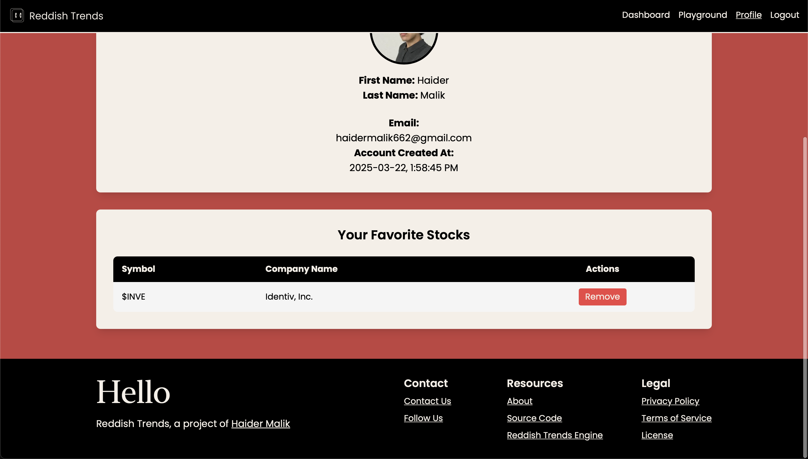
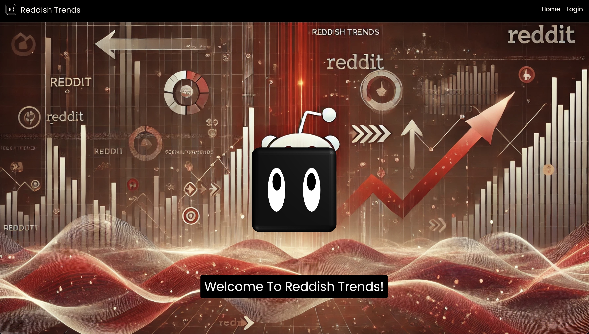

# Reddish Trends — Social Media Stock Market Analyst


Reddish Trends blends Reddit vibes with market data to surface the stocks people actually care about — then explains why. This repo contains the frontend and the backend glue that turns noisy Reddit posts into actionable signals.

## Quick links
- Live site: [reddishtrends.com](https://reddishtrends.com)  
- Engine (Github repo): [Reddish-Trends-Engine](https://github.com/HaiderMalikk/Reddish-Trends-Engine)

## Why this is fun (and useful) 🎉
- Real-time Reddit discovery + market-data enrichment  
- Compact, explainable 3-step ranking algorithm — repeat signals > one-off hype  
- Optional LLM enrichment for human-friendly summaries  
- Playable API for quick experiments

## Core backend highlights (expanded)
- Sentiment ingestion — Robust Reddit pipeline that fetches title, body and a capped set of top-level comments, builds a single "full_text" context blob per post, and computes compound sentiment so every symbol is scored against a consistent context window.
- Market enrichment — Fast enrichment layer that pulls period-based OHLC, computes percentage moves and a 14-period RSI, and returns a consistent data shape so UI and ranking logic remain stable even when symbols are missing or delisted.
- Ranking component — a compact, deterministic, explainable ranking system built for reliability and product clarity. This ranking is the signature piece of the engine and is designed to surface signals that matter to traders and product users, not noise.
  - Why it's special: It intentionally prioritizes repeatable, cross-community traction over single-post hype. The algorithm is deterministic, fast, and easy to audit — ideal for a consumer-facing product where explainability is essential.
  - The 3-step ranking funnel:
    1. Per-subreddit peak selection — pick the symbol(s) with the strongest sentiment in each community (local maxima). This isolates locally meaningful signals.
    2. Cross-subreddit frequency — reward symbols that appear as local peaks in multiple communities. Frequency across communities is interpreted as stronger, more generalizable signal.
    3. Subreddit mention-weight tie-break — when frequency ties occur, break ties using the local mention count (how many times the symbol was mentioned where it was strongest). This promotes symbols with deep local traction as well as broad reach.
  - Modulation & safety:
    - Sentiment normalization and optional thresholds reduce false positives from small-sample extremes.
    - Parameters (per-subreddit peak depth, minimum-frequency threshold, mention-weight multiplier) are configurable to tune sensitivity for production.
  - Benefits:
    - Explainable: every ranked symbol maps back to the specific posts/comments that produced it, enabling "why" explanations in the UI.
    - Deterministic: same inputs => same ranking, which is essential for reproducibility and debugging.
    - Lightweight: no heavy ML model required for the core ranking, keeping cost and complexity low.
  - Tiny conceptual usage (pseudocode):
    ```python
    # Run the pipeline for subreddits
    analysis = orchestration.run_general_analysis(["wallstreetbets","stocks"], limit=20)
    # Get the headline signals
    top = ranking_component.get_top_stock(analysis)
    worst = ranking_component.get_worst_stock(analysis)
    rising = ranking_component.get_rising_stock(analysis, limit=3)
    # Each item contains symbol, sentiment, count, linked post and enriched market fields
    ```
- API & scheduler (engine service) — endpoints expose cached summaries (Top/Worst/Rising) and a playground for ad-hoc queries. A scheduler refreshes the cache daily and a startup check ensures the cache is fresh on deploy.
- LLM summarization (optional) — concise JSON-formatted AI analysis that augments each headline symbol with human-readable commentary, confidence, and short recommendations (purely explanatory, not investment advice).

## Reddit fetching & preprocessing algorithm 🧩
We fetch and prepare Reddit content using a predictable, low-noise pipeline that's part of the sentiment ingestion step above:
- Fetch posts from a subreddit by type (hot / new / top / rising / controversial).  
- For "top" and "controversial" respect an optional time_filter (hour/day/week/month/year/all).  
- Load only top-level comments and limit them per-post via comment_limit for predictable latency.  
- Combine title, body, link and top comments into a single "full_text" blob for sentiment analysis and ticker extraction.  
- Extract tickers using a simple regex for $TICKER tokens (e.g. $TSLA, $AAPL) and compute average sentiment per symbol.  
- Normalize compound sentiment to improve ranking impact (small multiplier).

Quick view of the core behaviors (conceptual)
```python
# Engine behaviors (conceptual)
# - fetch N posts per subreddit and up to comment_limit top-level comments
# - build full_text = title + body + top comments and run sentiment analysis
# - extract tickers via r"\$[A-Z]+" and aggregate counts + sentiment per ticker
# - enrich tickers with market data and run the 3-step ranking filter
```

## Quickstart — run & call the API ⚡

### Run the backend engine
```bash
# Backend engine lives in its own repo — follow the Engine README to run the service:
# https://github.com/HaiderMalikk/Reddish-Trends-Engine
# When running locally the engine exposes API endpoints on port 5000 by default
```

### Call the API (curl)
```bash
curl -X POST http://localhost:5000/api/home \
  -H "Content-Type: application/json" \
  -d '{"request":{"type":"getgeneralanalysis"}}'
```

### Playground (Python)
```python
# example_playground.py (client)
import requests
payload = {
  "request": {"type": "getplaygroundgeneralanalysis",
    "parameters": {"subreddits": ["wallstreetbets","stocks"], "limit": 20, "comment_limit": 5, "sort": "hot", "time": None, "period": "1mo"}
  }
}
r = requests.post("http://localhost:5000/api/playground", json=payload)
print(r.json())
```

### Internal usage (conceptual)
```python
# Conceptual: use the engine's modules to run the pipeline and extract signals
# analysis = orchestration_module.run_general_analysis(["wallstreetbets","stocks"], limit=10)
# top = ranking_component.get_top_stock(analysis)
# rising = ranking_component.get_rising_stock(analysis, limit=3)
```

### Sample Top_Stock shape (abbrev.)
```json
{
  "symbol":"$SPY",
  "company_name":"SPDR S&P 500 ETF Trust",
  "count":3,
  "sentiment":8.71,
  "price":576.68,
  "percentage_change":-1.21,
  "rsi":28.53,
  "LLM_Analysis":{"overview":"...","prediction":"...","Confidence Score":78}
}
```

## Firebase (NoSQL) — user document example
We use Firebase Firestore to store user preferences, cached requests, and logs. Example user document (abbreviated):

```json
// example firebase user doc
{
  "uid": "mP7rW0bxvIV42ct9zMsqYMNJ7vE3",
  "createdAt": "2025-03-22T17:58:45.873Z",
  "email": "haidermalik662@gmail.com",
  "favorites": [
    { "companyName": "Identiv, Inc.", "symbol": "$INVE" }
  ],
  "requests": {
    "general_analysis": { "count": 37, "log": ["March 22, 2025 at 1:58:46..."] },
    "playground_analysis": {
      "count": 2,
      "log": [
        {
          "parameters": { "analysisType": "getplaygroundgeneralanalysis", "commentLimit": 10, "limit": 10, "period": "1mo", "sort": "hot", "subreddits": "wallstreetbets,stocks,stockmarket", "time": "none" },
          "timestamp": "2025-03-23T22:16:01-04:00"
        }
      ]
    }
  }
}
```

## Play with it 🔬
- `/api/home` → cached Top/Worst/Rising summaries  
- `/api/playground` → custom subreddit sets, time windows, symbol lists  
- Cache stored in `cached_analysis.json` — scheduler refreshes daily

## Design notes (short)
- Deterministic & explainable ranking > black-box for community products.  
- Cache + scheduler = fewer rate-limit headaches with Reddit / market APIs.  
- Modular design: swap sentiment, enrichment, or LLM independently.

## Frontend / Website — full feature list & tech
The website surfaces ranked signals and explains them — designed for fast scanning and transparency.

Core user-facing features
- Trending discovery: Top, Worst and Rising stocks detected across financial communities.  
- Post-level transparency: every signal links back to the Reddit post(s) that generated it so users can inspect context.  
- Market enrichment: live price, daily high/low, percent change and RSI shown alongside sentiment scores.  
- Confidence & explanations: optional LLM summaries explaining market sentiment, technical signals, fundamentals and a confidence score.  
- Playgrounds & custom queries: run custom analyses across subreddits, periods, and symbol lists via the playground API.  
- User personalization: favorites, request logs and account persistence using Firestore.  
- Clean UI & visuals: responsive summaries, card-based layouts and compact visual cues for quick decision-making.

Frontend tech
- Typescript, Next.js, Tailwind CSS  
- Firebase Firestore for user data and preferences  
- Hosting: Vercel (frontend) + Heroku/Render for backend (engine)

## Screenshots & preview








# 

<p align="center">
    
</p>

<p align="center">
    <strong>Reddish Trends</strong> — Haider Malik<br/>
    &copy; 2025 Haider Malik. All rights reserved.
</p>